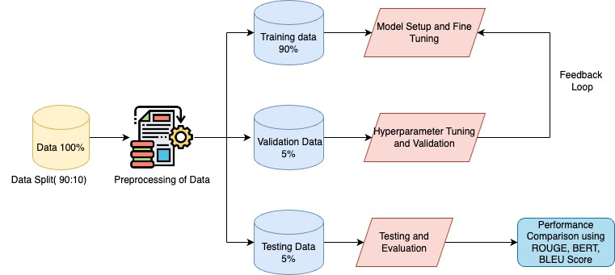

# TextSummarization

Transforming Text Summarization with Large Language Models” is an innovative research project carried out by students at the Department of Applied Data Science in San Jose State University. This project utilizes the most cutting-edge language models that include MPT-7b-instruct, Falcon-7b-instruct, OpenAI's ChatGPT text-davinci-003 and BERT to make text summarization tools more effective. We aim at optimizing the summary precision and depth through hybrid summarization techniques over traditional approaches based on lexical, graph-based and cluster-based methods.

Our project has developed a complex system that combines extractive and abstractive summarization methods after extensive experiments using CNN/Daily Mail and EdinburghNLP/xsum datasets. The findings indicate significant increase in quality of summarisation implying that there is scope for hybrid models to transform information processing and distribution within data-rich industries. In this repository, you will find all of the relevant code, data sets, and documentation utilized throughout our study.

